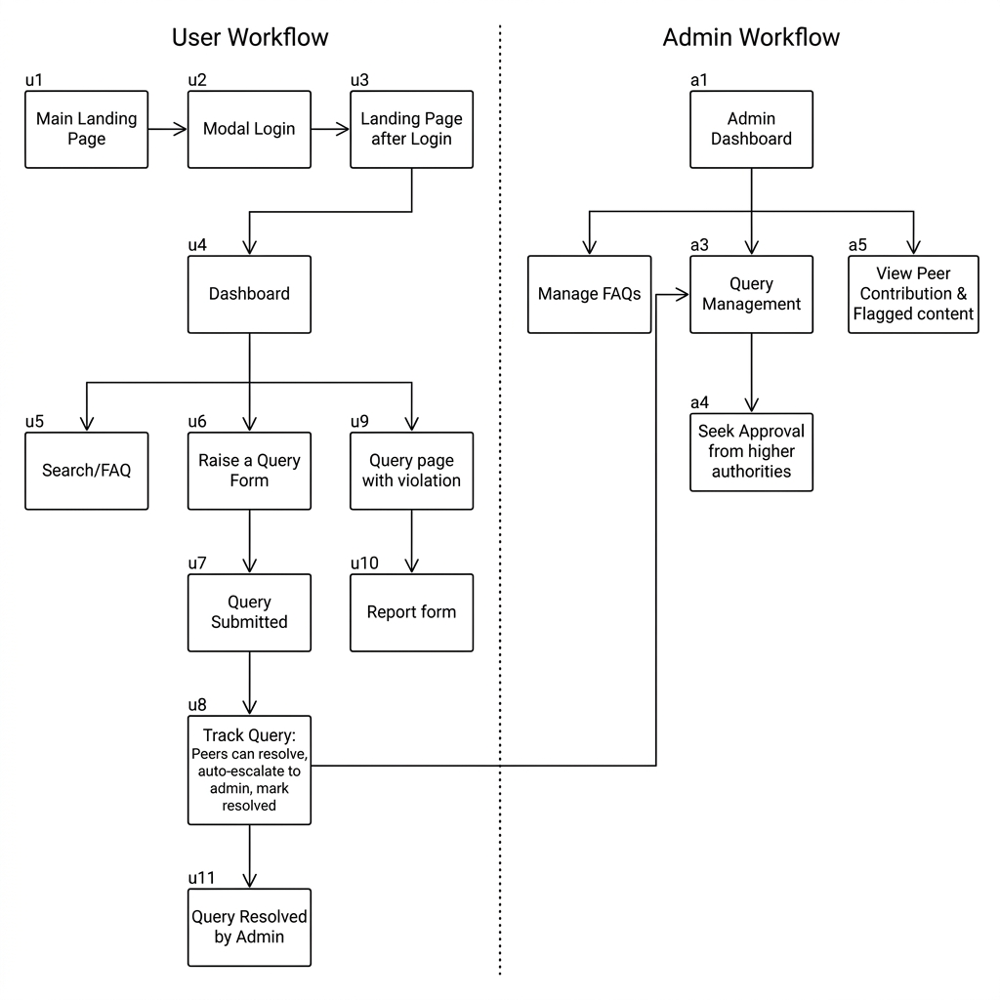

# Vicharanashala Lab Internship Hub

A comprehensive FAQ and Query Management Portal built for the Vicharanashala Lab Internship Hub.

## Wireframe Workflow


## Technology Stack
- **MongoDB**: Database for Users, Queries, and FAQs
- **Express.js**: Backend REST API framework
- **React.js (Vite)**: Frontend user interface
- **Node.js**: Backend runtime environment

## Workflows

### User Persona Workflow
- **[u1]** Main Landing Page
- **[u2]** Modal Login
- **[u3]** Landing Page (Post-Login)
- **[u4]** Dashboard
- **[u5]** Search Results / FAQ (accessed from u4 search bar)
- **[u6]** Raise a Query Form (accessed from u4)
- **[u7]** Query Submitted Confirmation
- **[u8]** Track Query Page (Peer resolution attempts, auto-escalation to admin, and marking as resolved)
- **[u9]** Violating Query Page (If code of conduct is violated)
- **[u10]** Report Form (Peers can submit reports from u9)
- **[u11]** Query Resolved by Admin (Updated page state)

### Admin Persona Workflow
- **[a1]** Admin Dashboard (Landing page after login)
- **Manage FAQs**: Update and manage the FAQ database
- **[a3]** Query Management (Address individual queries)
- **[a4]** Seek Approval (Admins can request approval from higher authorities)
- **[a5]** Peer Contribution & Flagged Content View

## Getting Started

### Prerequisites
- Node.js installed
- MongoDB instance running locally or via Atlas

### Installation
1. Clone the repository and navigate to the root directory `D:\internship_ropar\FAQ\Faq_iitr`.
2. Install Backend Dependencies:
   ```bash
   cd backend
   npm install
   ```
3. Install Frontend Dependencies:
   ```bash
   cd frontend
   npm install
   ```

### Running the Application
1. **Backend**: 
   - Navigate to `backend` and run `node server.js`
   - Server runs on port 5000 by default.
2. **Frontend**:
   - Navigate to `frontend` and run `npm run dev`
   - The React app will start via Vite.
